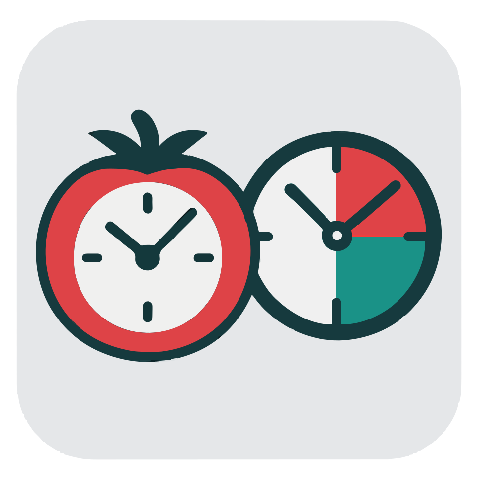

# Pomodoro Timer

<style>
.small-svg { width: 50%; height: 50%; }
</style>

<div style="text-align: center;">
  
</div>

A simple and elegant GUI Pomodoro Timer application for Linux built with Go and Fyne.

## Features

- **Visual Timer Display**: Large, centered digital clock with colored backgrounds
  - Black background when stopped/paused
  - Light green background during work sessions
  - Turquoise background during break sessions
- **Configurable Timings**: Customize work time, short breaks, long breaks, and break intervals
- **Automatic Transitions**: Seamless switching between work and break periods
- **Pause/Resume**: Suspend and continue timers with visual feedback
- **Window Management**: Proper window lifecycle management
- **Spanish Interface**: All text and notifications in Spanish

## Requirements

- Go 1.22.0 or later
- Linux operating system
- GUI environment (X11/Wayland)

## Runtime Dependencies

### ✅ **Go Dependencies (Compiled In)**
The binary **does NOT** have external Go runtime dependencies because:
- All Go dependencies are **statically compiled** into the binary
- The go.mod shows dependencies like Fyne, OpenGL bindings, etc., but these are embedded during compilation
- Go produces self-contained executables by default

### ⚠️ **System Library Dependencies (Required at Runtime)**
However, the binary **DOES** require these system libraries to be present on the target system:

#### **Essential System Dependencies:**
1. **OpenGL Libraries**
   - `libGL.so.1` (OpenGL runtime)
   - `libGLX.so.0` (GLX extension)

2. **X11/Wayland Display System**
   - `libX11.so.6` (X11 client library)
   - `libXrandr.so.2` (X11 RandR extension)
   - `libXi.so.6` (X11 Input extension)
   - `libXxf86vm.so.1` (X11 XF86VidMode extension)
   - OR Wayland libraries if running on Wayland

3. **Core System Libraries**
   - `libc.so.6` (Standard C library)
   - `libm.so.6` (Math library)
   - `libpthread.so.0` (POSIX threads)

#### **Graphics Driver Dependencies:**
- **Mesa drivers** (for software/hardware OpenGL)
- **GPU vendor drivers** (NVIDIA, AMD, Intel)

### 📦 **Distribution Considerations**

#### **Most Linux Systems Have These By Default:**
- Desktop Linux distributions (Ubuntu, Fedora, etc.) include these libraries
- Server distributions may need additional packages

#### **Required Packages for End Users:**
```bash
# Ubuntu/Debian
sudo apt-get install libgl1-mesa-glx libxrandr2 libxi6 libxxf86vm1

# Fedora/RHEL
sudo dnf install mesa-libGL libXrandr libXi libXxf86vm

# Arch Linux
sudo pacman -S mesa libxrandr libxi libxxf86vm
```

### 🎯 **Summary**

**The binary is NOT completely dependency-free**, but it's **practically portable** because:

✅ **Advantages:**
- No Go runtime or application-specific dependencies
- Single executable file
- Works on any Linux system with GUI support

⚠️ **Requirements:**
- Target system must have GUI environment (X11/Wayland)
- OpenGL support (hardware or software)
- Standard system libraries (usually present)

**For distribution:** The binary will run on 99% of desktop Linux systems without additional installation, but server or minimal systems may need graphics libraries installed.

## Installation

### Using Make (Recommended)

```bash
# Initialize dependencies
make init

# Build the application
make build

# Run the application
make run
```

### Manual Installation

```bash
# Clone and navigate to project
cd pomodoro

# Install dependencies
go mod tidy

# Build
go build -o bin/pomodoro ./src/...

# Run
./bin/pomodoro
```

## Usage

### Main Interface

- **Iniciar tiempo de trabajo**: Start a 20-minute work session
- **Suspender/Continuar**: Pause/resume the current timer
- **Iniciar tiempo de descanso**: Start a break session
- **Configuración**: Open configuration window

### Configuration

Customize the following settings:
- Work time duration (minutes)
- Short break duration (minutes)  
- Long break duration (minutes)
- Number of short breaks before a long break

## Development

### Available Make Commands

```bash
# Development
make help           # Show all available commands
make dev            # Clean, build, and run
make run-dev        # Run without building (development mode)
make watch          # Watch for changes and rebuild (requires entr)

# Building
make build          # Standard build
make build-release  # Optimized release build
make build-debug    # Debug build with symbols

# Quality Assurance
make lint           # Format and vet code
make test           # Run tests
make test-coverage  # Run tests with coverage report
make test-race      # Run tests with race detection
make benchmark      # Run benchmarks
make check          # Run all quality checks
make ci             # Full CI pipeline

# Maintenance
make clean          # Clean build artifacts
make info           # Show project information
make size           # Show binary size
```

### Project Structure

```
pomodoro/
├── src/                 # Source code
│   ├── main.go         # Main application logic
│   ├── config.go       # Configuration window
│   └── main_test.go    # Tests
├── bin/                # Built binaries
├── go.mod              # Go module definition
├── go.sum              # Dependency checksums
├── Makefile            # Build automation
└── README.md           # This file
```

## Testing

Run the test suite:

```bash
# Basic tests
make test

# With coverage
make test-coverage

# With race detection
make test-race

# Benchmarks
make benchmark
```

## Building for Release

```bash
# Optimized release build
make build-release

# Check binary size
make size
```

## Contributing

1. Fork the repository
2. Create a feature branch
3. Make your changes
4. Run quality checks: `make check`
5. Submit a pull request

## Architecture

The application follows a clean architecture:

- **main.go**: Core application logic, GUI setup, timer management
- **config.go**: Configuration window and settings management
- **Custom Widgets**: LargeTimeLabel for enhanced time display
- **Proper Threading**: Fyne-safe GUI updates using `fyne.Do()`

## License

This project is open source. See the license file for details.

## Technical Details

- **GUI Framework**: Fyne v2.6.3
- **Language**: Go 1.22.0+
- **Platform**: Linux
- **Architecture**: Clean separation of concerns with custom widgets
- **Thread Safety**: Proper Fyne threading model implementation
